# Maven Adventure Works Project
## Introduction


This Project Case is part of the [Microsoft Power BI Desktop for Business Intelligence Course](https://www.udemy.com/course/microsoft-power-bi-up-running-with-power-bi-desktop/) on [Udemy](https://www.udemy.com) online platform by **Maven Analytics**. In this case, I am being put in the point of view of a Business Intelligence Analyst in **AdventureWorks**, a global manufacturing company that runs cycling equipment and accessories production. The objectives are to transform raw data into a dashboard report to help the Management Team track the KPI, monitor and compare the performance, and identify some insights, as well as high value customers. I worked through the entire business intelligence workflow, i.e.: **connecting and transforming the raw data, building a relational data model, creating calculated fields and measures with DAX, and designing an interactive report** to visualize the data.

## Problem Questions

## Datasets

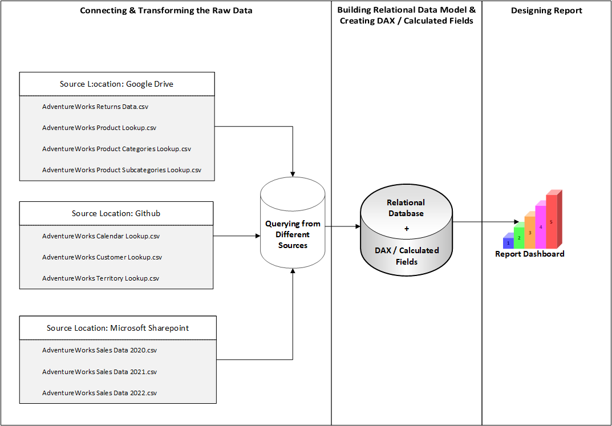

There are 8 Datasets used in this project, i.e.:

**1. Returns Dataset (AdventureWorks Returns Data.csv)**

| **Field Name** | **Data Type** |
| ------ | ------ |
| ReturnDate | Date |
| TerritoryKey | Whole Number |
| ProductKey | Whole Number |
| ReturnQuantity | Whole Number |

**2. Products Lookup Dataset (AdventureWorks Product Lookup.csv)**

| **Field Name** | **Data Type** |
| ------ | ------ |
| ProductKey | Whole Number |
| ProductSubcategoryKey | Whole Number |
| ProductSKU | Text |
| ProductName | Text |
| ModelName | Text |
| ProductDescription | Text |
| ProductColor | Text |
| ProductStyle | Text |
| ProductCost | Fixed Decimal Number |
| ProductPrice | Fixed Decimal Number |
| SKU Type | Text |
| DiscountPrice | Fixed Decimal Number|


**3. Product Category Lookup Dataset (AdventureWorks Product Categories Lookup.csv)**

| **Field Name** | **Data Type** |
| ------ | ------ |
| ProductCategoryKey | Whole Number |
| CategoryName | Text |

**4. Product Subcategory Lookup Dataset (AdventureWorks Product Subcategories Lookup.csv)**

| **Field Name** | **Data Type** |
| ------ | ------ |
| ProductSubcategoryKey | Whole Number |
| SubcategoryName | Text |
| ProductCategoryKey | Whole Number |

**5. Calendar Lookup Dataset (AdventureWorks Calendar Lookup.csv)**

| **Field Name** | **Data Type** |
| ------ | ------ |
| Date | Date |
| Day Name | Text |
| Start of Week | Date |
| Start of Month | Date |
| Start of Quarter | Date |
| Month Name | Text |
| Month | Whole Number |
| Start of Year | Date |
| Year | Whole Number |

**6. Customer Lookup Dataset (AdventureWorks Customer Lookup.csv)**

| **Field Name** | **Data Type** |
| ------ | ------ |
| CustomerKey | Whole Number |
| Prefix | Text |
| FirstName | Text |
| LastName | Text |
| BirthDate | Date |
| MaritalStatus | Text |
| Gender | Text |
| EmailAddress | Text |
| AnnualIncome | Fixed Deci9mal Number |
| TotalChildren | Whole Number |
| EducationLevel | Text |
| Occupation | Text |
| HomeOwner | Text |
| FullName | Text |
| DomainName | Text |

**7. Territory Lookup Dataset (AdventureWorks Territory Lookup.csv)**

| **Field Name** | **Data Type** |
| ------ | ------ |
| SalesTerritoryKey | Whole Number |
| Region | Text |
| Country | Text |
| Continent | Text |

**8. Sales Dataset (AdventureWorks Sales Data 2020.csv, AdventureWorks Sales Data 2021.csv, & AdventureWorks Sales Data 2022.csv)**

| **Field Name** | **Data Type** |
| ------ | ------ |
| OrderDate | Date |
| StockDate | Date |
| OrderNumber | Text |
| ProductKey | Whole Number |
| CustomerKey | Whole Number |
| TerritoryKey | Whole Number |
| OrderLineItem | Whole Number |
| OrderQuantity | Whole Number |

## Connecting and Shaping the Data

There are several steps in this phase in order to connect and shape the Data used in this case.

**1. Update Power BI options and settings by:** 

- Deselecting the "Autodetect new relationships after data is loaded" option in the Data Load tab
- Making sure that Locale for import is set to "English (United States)" in the Regional Settings tab

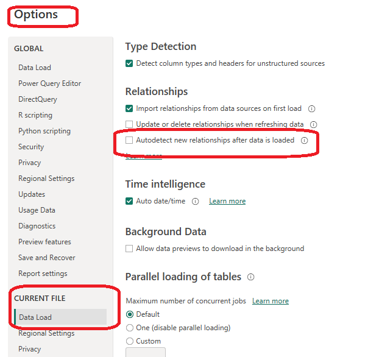

**2. Connect to the AdventureWorks Customer Lookup csv file by:**

- Naming the table "Customers Lookup", and making sure that headers have been promoted
- Confirming that data types are accurate (Note: "CustomerKey", "AnnualIncome", "TotalChildren" should be whole numbers, "Prefix", "FirstName", "LastName", MaritalStatus", "Gender", "EducationLevel", "EmailAddress", "Occupation", and "HomeOwner" should be text, and "BirthDate" should be Date, )
- Removing rows the CustomerKey of it is null
- Creating a new column named "FullName", "EmailAddress" and "DomainName" as well as formating them as text

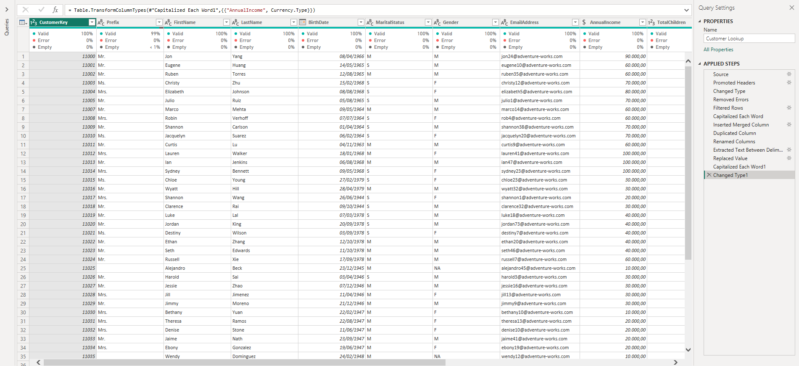

**3. Connect to the AdventureWorks Product Lookup csv file by:**

- Naming the table "Product Lookup" and making sure that headers have been promoted
- Removing "ProductSize" column because it was not needed.
- Confirming that data types are accurate (Note: "ProductKey", "ProductSubcategoryKey" should be whole numbers, -- "ProductSKU", "ProductName", "ModelName", "ProductDescription", "ProductColor", "ProductStyle", and "SKUType" should be Text, --"ProductCost", "ProductPrice", and "DiscountPrice" should be Fixed Decimal Number)
- Replacing "0" values with "NA" in "ProductStyle" column.

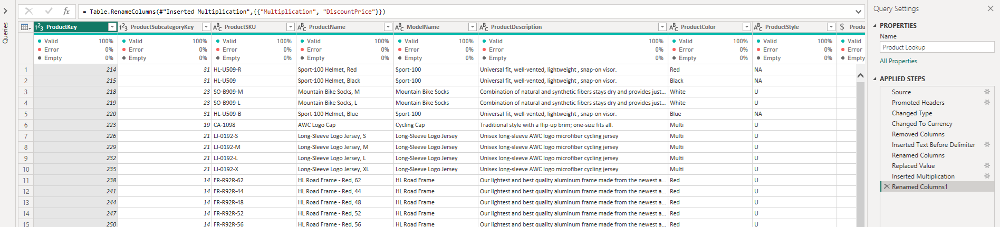

**4. Connect to the AdventureWorks Product Category Lookup csv file by:**

- Naming the table "Product Category Lookup" and making sure that headers have been promoted
- Confirming that data types are accurate (Note: "ProductCategoryKey" should be Whole Number and "CategoryName" must be Text)

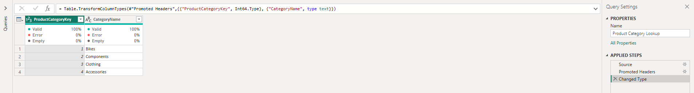

**5. Connect to the AdventureWorks Product Subcategory Lookup csv file by:**

- Naming the table "Product Subcategory Lookup" and making sure that headers have been promoted
- Confirming that data types are accurate. "ProductSubcategoryKey" and "ProductCategoryKey" should be Whole Number, while "SubcategoryName" must be Text).

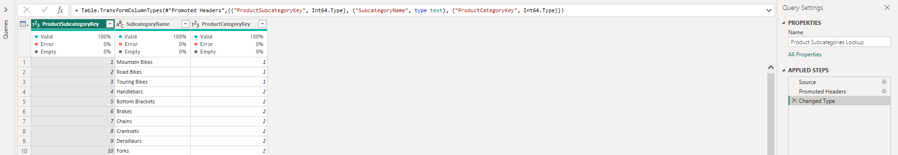

**6. Connect to the AdventureWorks Territory Lookup csv file by:**

- Naming the table "Territory Lookup" and making sure that headers have been promoted
- Confirming that data types are accurate (Note: All "Region", "Country", "Continent" data types should be Text, while "SalesTerritoryKey" is Whole Number)

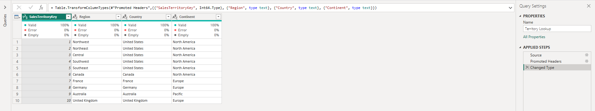

**7. Connect to the AdventureWorks Calendar Lookup csv file by:**

- Naming the table "Calendar Lookup" and making sure that headers have been promoted
- Using the date tools in the query editor to add the following columns:
    > "Day Name", "Start of Week", "Start of Month", "Start of Quarter", "Month Name", "Month", "Start of Year", "Year"
- Confirming that the data types are accurate. This means all "Date", "Start of Week", "Start of Month", "Start of Quarter", and "Start of Year" data types are Date, while "Day Name" and "Month Name" are Text, leaving "Month" and "Year" with Whole Number data type.

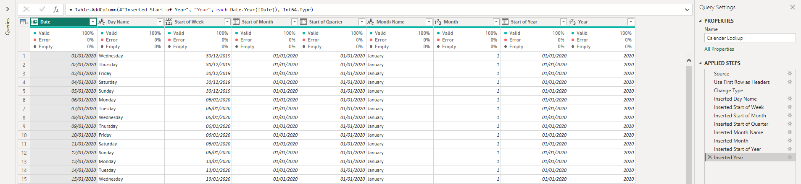

**8. Connect to the AdventureWorks Returns csv file by:**

- Naming the table "Returns Data" and making sure that headers have been promoted
- Confirming that data types are accurate (all "Key" and "Quantity" columns should be whole numbers, while "ReturnDate" is Date)

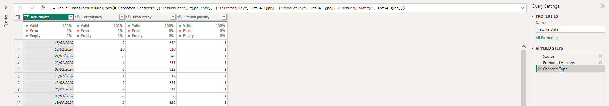

**9. Connect to the AdventureWorks Sales Data by:**

- Connecting to the AdventureWorks Sales Data 2020, 2021, and 2022 csv file from the Microsoft Sharepoint. 
- Signing with the account credential to query those 3 files into the Power BI Query Editor.
- Naming the 3 tables "Sales 2020", "Sales 2021", and "Sales 2022" respectively, as well as confirming that headers have been promoted for each corresponding table.
- Confirming that data types are accurate. "OrderDate", "StockDate" data types are Date. "OrderNumber" data type is Text, while the data types for "ProductKey", "CustomerKey", "TerritoryKey", "OrderLineItem", and "OrderQuantity" are Whole Number.
- Since I merged 3 Tables (Sales Data 2020, 2021, and 2022), I only need to load the merged table (Sales Data Table). The 3 source data queries were not to be loaded. Therefore, I unchecked the Enable Load option in the Query Editor to disable "Include in report refresh" option.

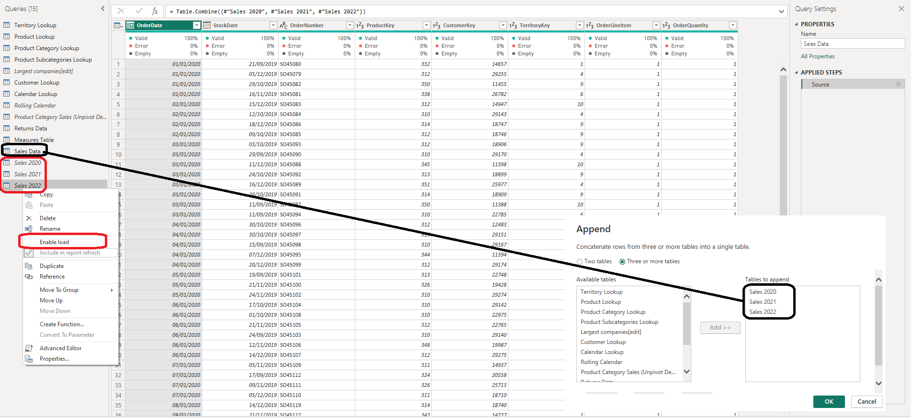

**10. With the exception of the other three data tables ("Largest companies", "Rolling Calendar", "Product Category Sales", disable "Include in Report Refresh", then Close & Apply by:**

- Confirming that all 8 tables are now accessible within both the RELATIONSHIPS view and the DATA view

## Building a Relational Model

There are several steps in this phase in order to build a Relational Model.

**1. In the MODEL view, arrange the tables so that the lookup tables are above the data tables by:**

- Connecting Transaction_Data to Customers, Products, and Stores using valid primary/foreign keys 
- Connecting Transaction_Data to Calendar using both date fields, with an inactive "stock_date" relationship
- Connecting Return_Data to Products, Calendar, and Stores using valid primary/foreign keys
- Connecting Stores to Regions as a "snowflake" schema

**2. Confirm the following:**

- All relationships follow one-to-many cardinality, with primary keys (1) on the lookup side and foreign keys (*) on the data side
- Filters are all one-way (no two-way filters)
- Filter context flows "downstream" from lookup tables to data tables
- Data tables are connected via shared lookup tables (not directly to each other)

**3. Hide all foreign keys in both data tables from Report View, as well as "region_id" from the Stores table**

**4. In the DATA view, complete the following steps by:**
- Updating all date fields (across all tables) to the "M/d/yyyy" format using the formatting tools in the Modeling tab
- Updating "product_retail_price", "product_cost", and "discount_price" to Currency ($ English) format
- In the Customers table, categorizing "customer_city" as City, "customer_postal_code" as Postal Code, and "customer_country" as Country/Region
- In the Stores table, categorizing "store_city" as City, "store_state" as State or Province, "store_country" as Country/Region, and "full_address" as Address 

All the steps above resulted in the following Relation Model:

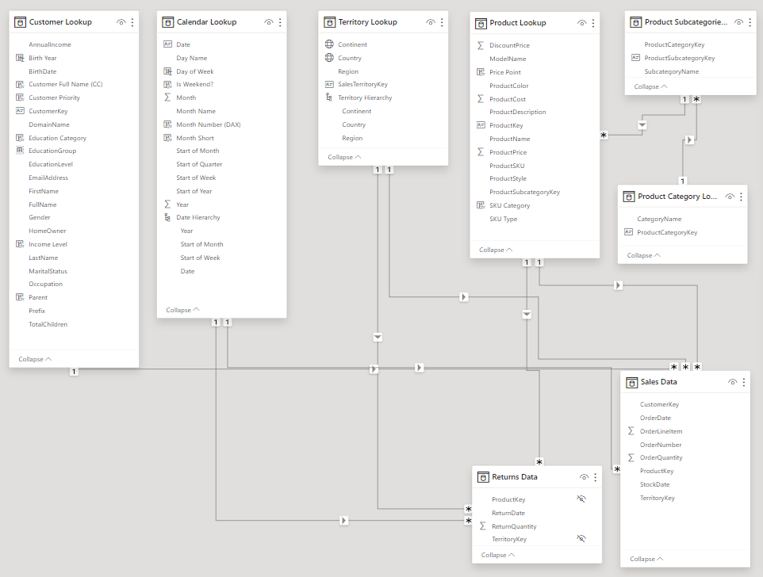

## Adding Calculated Fields and DAX (Data Analysis eXpression)
There are 3 spots in which I worked to add Calculation Fields and DAX, i.e. the **Data View**, the **Report View**, and the **Additional Tables for Metric Selection**.

**1. In the DATA view, add the following calculated columns into Calendar Lookup Table by:**
- Adding Day of Week Calculation Field:
  ```Sh
  Day of Week = WEEKDAY('Calendar Lookup'[Date],2)
  ```
  
- Adding Is Weekend?:
  ```Sh
  Is Weekend? = if('Calendar Lookup'[Day of Week]= 6 || 'Calendar Lookup'[Day of Week] = 7,"Weekend","Weekday")
  ```
  
- Adding Month Number:
  ```Sh
  SWITCH ('Calendar Lookup'[Month Name],
    "January","1","February","2","March","3","April","4","May","5","June","6",
    "July","7","August","8","September","9","October","10","November","11","December","12", "Others")
  ```
  
- Adding Month Short:
  ```Sh
  Month Short = UPPER(LEFT('Calendar Lookup'[Month Name],3))
  ```
  
**2. In the REPORT view, add the following measures (Assign to tables as you see fit, and use a matrix to match the "spot check" values) by:**


**3. In the Additional Tables for Metric Selection, add the following Measures by:**


Executing all the detailed Steps in 3 spots above, resulted in adding a new Table containing all Measures needed in the modelling.

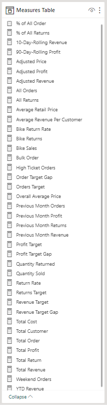

The overall tables created the complete Relation Model for all the data loaded in the Power Bi

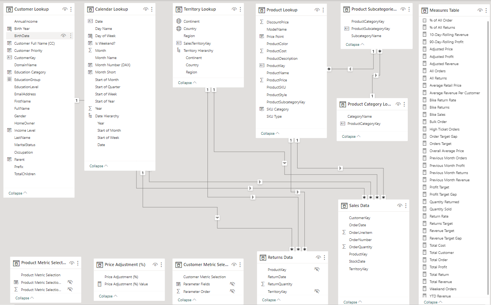

## Building Interactive Report

The report dashboard is to provide information in the Problem Questions Section. Below is the Dashboard for the report.


I also built a Note Report Page where its purpose is to provide insights (by utilizing the Bookmark function) so that it can be quickly shown to the management / stakeholders. Later on, for future use, I can add as many insights as can be found based on the data. Yet, in this case I only provided 3 quick insights, i.e.: Portland 1000 Sales, Victoria Hits Positive, and Plato drove the highest profit rate.


## Analysis to answer the Problem Questions
- Defining the Top 30 Product Brands with most Total Transactions and their corresponding Profit, Profit Margin, as well as Return Rate in descending order.

**Solution:**


Based on the picture above, Hermanos peaked the position of the Top 30 Product Brands with the most Total Transaction of 5,342 with Total Profit of $ 21,753 and Margin of 58.64%, as well as Return Rate of 0.95%. Its position is followed by Ebony and Tell Tale in the second and third position. All the Top 30 Product Brand drove a total of 113,668 Transactions, with acumulative Profit Margin of 59.94% that equals to Total Profit of $ 449,627, and total Return Rate of 1.00%.

- Providing KPI information displaying the Current Month Transactions vs Last Month Transactions, Current Month Profit vs Last Month Profit, and Current Month Returns vs Last Month Returns.

**Solution:**


Based on the scorecards displayed above, the Total Transactions in the current month had reached 18,325 number of transaction. This has surpassed the target of 17,339 transaction (around 5.69% increment) above the last month transaction. This drove a 5.61% increment of profit which equals of a Total Profit of $ 71,682 in the current month. However, it turned out that in the same period, the current Monthly Returned also increased by 2.9% or equals 14 additional returns from the previous month return (482). This means along with the increasing number of transaction, there was also an increasing number of goods returned. It is advisable to examine the cause as well of the type of the returned goods.

- Displaying a visual geographical map showing Transactions by Cities in which the company stores are operating.

**Solution:**


If we expand the map on the Dashboard, we will see from the map above that most of the stores are located in USA, while the country with the second most store number is Mexico. Canada is in the 3rd place for number of store in the country. This number of store drove the number of transaction, as well as total profit gained (representated by the bubble size).


A quick spot check for Total Transactions and Total Profit for each country has confirmed that.

- Providing information of Total Transaction in each of the country that can be drilled up/down, so that the granularity of the information can be determined in either level of country, city, or state.

**Solution:**


The Treemap above implies that most of the Transaction happened in the USA. This is because most stores are located in USA. This is aligned with the information provided in the previous solution. The more stores are open, the more Transaction will take place, which eventually would drive the Total Profit.

- Providing the weekly trending of the company's revenue, especially during the year 1998. Besides that, the management also wanted to find out the highest monthly revenue ever achieved.

**Solution:**


Based on the visuals above, the revenue experienced fluctuation over the time during year 1998. The highest revenue ever achieved was $ 120K, a slightly different from the corresponding target of around $ 119K.

## Report Dashboard Link:
The live report dashboard can be found [here](https://app.powerbi.com/groups/me/reports/aa4bad5c-0c93-4414-a8af-5376159b304b/ReportSection1d63a5027250201e045d?experience=power-bi)
