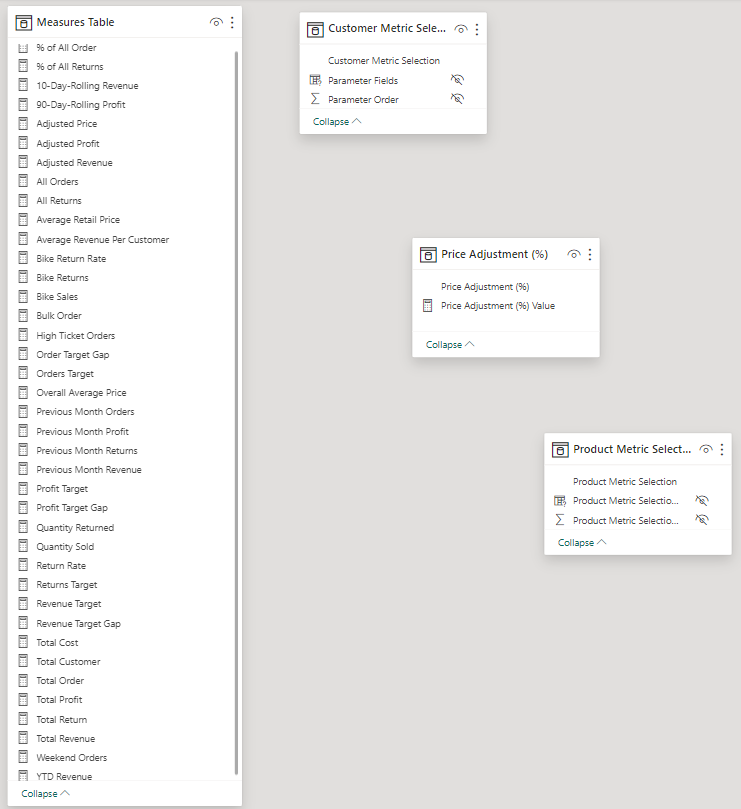

# Maven Adventure Works Project
## Introduction


This Project Case is part of the [Microsoft Power BI Desktop for Business Intelligence Course](https://www.udemy.com/course/microsoft-power-bi-up-running-with-power-bi-desktop/) on [Udemy](https://www.udemy.com) online platform by **Maven Analytics**. In this case, I am being put in the point of view of a Business Intelligence Analyst in **AdventureWorks**, a global manufacturing company that runs cycling equipment and accessories production. The Management Team needs a way to track the KPI, monitor and compare the performance, and identify some insights, as well as high value customers. 

## Objectives
Using the Power BI to:
- Connect and transform the raw data
- Build a relational data model
- Create calculated columns and measures with DAX (Data Analysis eXpression)
- Design an interactive dashboard to visualize the data

## Datasets


There are 8 Datasets used in this project, i.e.:

**1. Returns Dataset (AdventureWorks Returns Data.csv)**

| **Field Name** | **Data Type** |
| ------ | ------ |
| ReturnDate | Date |
| TerritoryKey | Whole Number |
| ProductKey | Whole Number |
| ReturnQuantity | Whole Number |

**2. Products Lookup Dataset (AdventureWorks Product Lookup.csv)**

| **Field Name** | **Data Type** |
| ------ | ------ |
| ProductKey | Whole Number |
| ProductSubcategoryKey | Whole Number |
| ProductSKU | Text |
| ProductName | Text |
| ModelName | Text |
| ProductDescription | Text |
| ProductColor | Text |
| ProductStyle | Text |
| ProductCost | Fixed Decimal Number |
| ProductPrice | Fixed Decimal Number |
| SKU Type | Text |
| DiscountPrice | Fixed Decimal Number|


**3. Product Category Lookup Dataset (AdventureWorks Product Categories Lookup.csv)**

| **Field Name** | **Data Type** |
| ------ | ------ |
| ProductCategoryKey | Whole Number |
| CategoryName | Text |

**4. Product Subcategory Lookup Dataset (AdventureWorks Product Subcategories Lookup.csv)**

| **Field Name** | **Data Type** |
| ------ | ------ |
| ProductSubcategoryKey | Whole Number |
| SubcategoryName | Text |
| ProductCategoryKey | Whole Number |

**5. Calendar Lookup Dataset (AdventureWorks Calendar Lookup.csv)**

| **Field Name** | **Data Type** |
| ------ | ------ |
| Date | Date |
| Day Name | Text |
| Start of Week | Date |
| Start of Month | Date |
| Start of Quarter | Date |
| Month Name | Text |
| Month | Whole Number |
| Start of Year | Date |
| Year | Whole Number |

**6. Customer Lookup Dataset (AdventureWorks Customer Lookup.csv)**

| **Field Name** | **Data Type** |
| ------ | ------ |
| CustomerKey | Whole Number |
| Prefix | Text |
| FirstName | Text |
| LastName | Text |
| BirthDate | Date |
| MaritalStatus | Text |
| Gender | Text |
| EmailAddress | Text |
| AnnualIncome | Fixed Decimal Number |
| TotalChildren | Whole Number |
| EducationLevel | Text |
| Occupation | Text |
| HomeOwner | Text |
| FullName | Text |
| DomainName | Text |

**7. Territory Lookup Dataset (AdventureWorks Territory Lookup.csv)**

| **Field Name** | **Data Type** |
| ------ | ------ |
| SalesTerritoryKey | Whole Number |
| Region | Text |
| Country | Text |
| Continent | Text |

**8. Sales Dataset (AdventureWorks Sales Data 2020.csv, AdventureWorks Sales Data 2021.csv, & AdventureWorks Sales Data 2022.csv)**

| **Field Name** | **Data Type** |
| ------ | ------ |
| OrderDate | Date |
| StockDate | Date |
| OrderNumber | Text |
| ProductKey | Whole Number |
| CustomerKey | Whole Number |
| TerritoryKey | Whole Number |
| OrderLineItem | Whole Number |
| OrderQuantity | Whole Number |

## Connecting and Shaping the Data

There are several steps in this phase in order to connect and shape the Data used in this case.

**1. Update Power BI options and settings by:** 

- Deselecting the "Autodetect new relationships after data is loaded" option in the Data Load tab
- Making sure that Locale for import is set to "English (United States)" in the Regional Settings tab


**2. Connect to the AdventureWorks Customer Lookup csv file by:**

- Naming the table "Customers Lookup", and making sure that headers have been promoted
- Confirming that data types are accurate (Note: "CustomerKey", "AnnualIncome", "TotalChildren" should be whole numbers, "Prefix", "FirstName", "LastName", MaritalStatus", "Gender", "EducationLevel", "EmailAddress", "Occupation", and "HomeOwner" should be text, and "BirthDate" should be Date, )
- Removing rows the CustomerKey of it is null
- Creating a new column named "FullName", "EmailAddress" and "DomainName" as well as formating them as text


**3. Connect to the AdventureWorks Product Lookup csv file by:**

- Naming the table "Product Lookup" and making sure that headers have been promoted
- Removing "ProductSize" column because it was not needed.
- Confirming that data types are accurate (Note: "ProductKey", "ProductSubcategoryKey" should be whole numbers, -- "ProductSKU", "ProductName", "ModelName", "ProductDescription", "ProductColor", "ProductStyle", and "SKUType" should be Text, --"ProductCost", "ProductPrice", and "DiscountPrice" should be Fixed Decimal Number)
- Replacing "0" values with "NA" in "ProductStyle" column.


**4. Connect to the AdventureWorks Product Category Lookup csv file by:**

- Naming the table "Product Category Lookup" and making sure that headers have been promoted
- Confirming that data types are accurate (Note: "ProductCategoryKey" should be Whole Number and "CategoryName" must be Text)


**5. Connect to the AdventureWorks Product Subcategory Lookup csv file by:**

- Naming the table "Product Subcategory Lookup" and making sure that headers have been promoted
- Confirming that data types are accurate. "ProductSubcategoryKey" and "ProductCategoryKey" should be Whole Number, while "SubcategoryName" must be Text).


**6. Connect to the AdventureWorks Territory Lookup csv file by:**

- Naming the table "Territory Lookup" and making sure that headers have been promoted
- Confirming that data types are accurate (Note: All "Region", "Country", "Continent" data types should be Text, while "SalesTerritoryKey" is Whole Number)


**7. Connect to the AdventureWorks Calendar Lookup csv file by:**

- Naming the table "Calendar Lookup" and making sure that headers have been promoted
- Using the date tools in the query editor to add the following columns:
    > "Day Name", "Start of Week", "Start of Month", "Start of Quarter", "Month Name", "Month", "Start of Year", "Year"
- Confirming that the data types are accurate. This means all "Date", "Start of Week", "Start of Month", "Start of Quarter", and "Start of Year" data types are Date, while "Day Name" and "Month Name" are Text, leaving "Month" and "Year" with Whole Number data type.


**8. Connect to the AdventureWorks Returns csv file by:**

- Naming the table "Returns Data" and making sure that headers have been promoted
- Confirming that data types are accurate (all "Key" and "Quantity" columns should be whole numbers, while "ReturnDate" is Date)


**9. Connect to the AdventureWorks Sales Data by:**

- Connecting to the AdventureWorks Sales Data 2020, 2021, and 2022 csv file from the Microsoft Sharepoint. 
- Signing with the account credential to query those 3 files into the Power BI Query Editor.
- Naming the 3 tables "Sales 2020", "Sales 2021", and "Sales 2022" respectively, as well as confirming that headers have been promoted for each corresponding table.
- Confirming that data types are accurate. "OrderDate", "StockDate" data types are Date. "OrderNumber" data type is Text, while the data types for "ProductKey", "CustomerKey", "TerritoryKey", "OrderLineItem", and "OrderQuantity" are Whole Number.
- Since I merged 3 Tables (Sales Data 2020, 2021, and 2022), I only need to load the merged table (Sales Data Table). The 3 source data queries were not to be loaded. Therefore, I unchecked the Enable Load option in the Query Editor to disable "Include in report refresh" option.


**10. With the exception of the other three data tables ("Largest companies", "Rolling Calendar", "Product Category Sales", disable "Include in Report Refresh", then Close & Apply by:**

- Confirming that all 8 tables are now accessible within both the RELATIONSHIPS view and the DATA view

## Building a Relational Model

There are several steps in this phase in order to build a Relational Model. These steps involves Tables from 2 different groups **(Lookup Tables & Data Tables)**:

**A. Lookup Tables:**
> Calendar Lookup, Customer Lookup, Product Category Lookup, Product Lookup, Product Subcategories Lookup, and Territory Lookup.

**B. Data Tables:**
> Returns Data and Sales Data

Those steps are as follow:

**1. In the MODEL view, arrange the tables so that the lookup tables are above the data tables by:**

- Connecting Returns Data to Territory, Calendar, and Product Lookup using valid primary/foreign keys 
- Connecting Sales Data to Customer, Calendar, Territory, and Product Lookup using using valid primary/foreign keys
- Connecting Product Lookup to Product Subcategories as a "snowflake" schema
- Connecting Product Subcategories to Product Category Lookup as a "snowflake" schema

**2. Confirm the following:**

- All relationships follow one-to-many cardinality, with primary keys (1) on the lookup side and foreign keys (*) on the data side
- Filters are all one-way (no two-way filters)
- Filter context flows "downstream" from lookup tables to data tables
- Data tables are connected via shared lookup tables (not directly to each other). In this case, no direct connection between Sales Data Table with Returns Data Table

**3. Hide all foreign keys in Return Data Table from Report View**

**4. In the DATA view, complete the following steps by:**
- Updating all date fields (across all tables) to the "dd/mm/yyyy" (short date) format using the formatting tools in the Modeling tab
- Updating "ProductPrice", "DiscountPrice", and "ProductCost" to Currency ($ English) with 2 decimal places format
- In the Territory Lookup Table, categorizing "Continent" as Continent, and "Country" as Country

All the steps above resulted in the following Relation Model:


## Adding Calculated Fields and DAX (Data Analysis eXpression)
There are 3 spots in which I worked to add Calculation Fields and DAX, i.e. the **Data View**, the **Report View**, and the **Additional Tables for Metric Selection**.

**1. In the DATA view, add the following calculated columns by:**
- Adding "Day of Week" Calculation Field:
  ```Sh
  Day of Week = WEEKDAY('Calendar Lookup'[Date],2)
  ```
  
- Adding "Is Weekend?":
  ```Sh
  Is Weekend? = if('Calendar Lookup'[Day of Week]= 6 || 'Calendar Lookup'[Day of Week] = 7,"Weekend","Weekday")
  ```
  
- Adding "Month Number":
  ```Sh
  SWITCH ('Calendar Lookup'[Month Name],
    "January","1","February","2","March","3","April","4","May","5","June","6",
    "July","7","August","8","September","9","October","10","November","11","December","12", "Others")
  ```
  
- Adding "Month Short":
  ```Sh
  Month Short = UPPER(LEFT('Calendar Lookup'[Month Name],3))
  ```
The above 4 Calculated Fields were added into **Calendar Lookup Table**.

- Adding "Birth Year":
  ```Sh
  Birth Year = YEAR('Customer Lookup'[BirthDate])
  ```
  
- Adding "Customer Full Name":
  ```Sh
  Customer Full Name (CC) = 'Customer Lookup'[Prefix]&" "&'Customer Lookup'[FirstName]&" "&'Customer Lookup'[LastName]
  ```
  
- Adding "Customer Priority":
  ```Sh
  Customer Priority = IF ('Customer Lookup'[Parent]="Yes" && 'Customer Lookup'[AnnualIncome]>100000,"Priority","Standard")
  ```
  
- Adding "Education Category":
  ```Sh
  Education Category = SWITCH(
      'Customer Lookup'[EducationLevel],
      "High School","High School",
      "Partial High School","High School",
      "Bachelors","Undergrad",
      "Partial College","Undergrad",
      "Graduate"
    )
  ```
  
- Adding "Income Level":
  ```S
  Income Level = SWITCH (TRUE(),
    'Customer Lookup'[AnnualIncome]>=150000,"Very High",
    'Customer Lookup'[AnnualIncome]>=100000,"High",
    'Customer Lookup'[AnnualIncome]>=50000,"Average",
    "Low"
    )
  ```
  
- Adding "Parent":
  ```Sh
  Parent = if('Customer Lookup'[TotalChildren]>0,"Yes","No")
  ```
  
The above 6 Calculated Fields were added into **Customer Lookup Table**.

- Adding "Price Point":
  ```Sh
  Price Point = SWITCH(TRUE(),
    'Product Lookup'[ProductPrice]>500,"High",
    'Product Lookup'[ProductPrice]>100,"Mid-Range",
    "Low"
  )
  ```
  
- Adding "SKU Category":
  ```Sh
  SKU Category = LEFT('Product Lookup'[ProductSKU],SEARCH("-",'Product Lookup'[ProductSKU])-1)
  ```
  
The above 2 Calculated Fields were added into **Product Lookup Table**.

**2. In the REPORT view, add the following measures (Assign to tables as you see fit, and use a matrix to match the "spot check" values) by:**
- Creating new measures named "Total Cost":
  ```Sh
  Total Cost = SUMX('Sales Data','Sales Data'[OrderQuantity]*RELATED('Product Lookup'[ProductCost]))
  ```
- Creating new measures named "Total Customer":
  ```Sh
  Total Customer = DISTINCTCOUNT('Sales Data'[CustomerKey])
  ```
- Creating new measures named "Total Order":
  ```Sh
  Total Order = DISTINCTCOUNT('Sales Data'[OrderNumber])
  ```
- Creating new measures named "Total Revenue":
  ```Sh
  Total Revenue =  SUMX('Sales Data','Sales Data'[OrderQuantity]*RELATED('Product Lookup'[ProductPrice]))
  ```
- Creating new measures named "Total Profit":
  ```Sh
  Total Profit = [Total Revenue]-[Total Cost]
  ```
- Creating new measures named "Total Return":
  ```Sh
  Total Return = COUNT('Returns Data'[ReturnQuantity])
  ```
- Creating new measures named "Weekend Orders":
  ```Sh
  Weekend Orders = CALCULATE([Total Order],'Calendar Lookup'[Is Weekend?]="Weekend")
  ```
- Creating new measures named "YTD Revenue":
  ```Sh
  YTD Revenue = CALCULATE([Total Revenue],DATESYTD('Calendar Lookup'[Date]))
  ```
- Creating new measures named "All Orders":
  ```Sh
  All Orders = CALCULATE([Total Order],ALL('Sales Data'))
  ```
- Creating new measures named "All Returns":
  ```Sh
  All Returns = CALCULATE([Total Return],all('Returns Data'))
  ```
- Creating new measures named "Average Retail Price":
  ```Sh
  Average Retail Price = AVERAGE('Product Lookup'[ProductPrice])
  ```
- Creating new measures named "Average Revenue Per Customer":
  ```Sh
  Average Revenue Per Customer = DIVIDE([Total Revenue],[Total Customer])
  ```
- Creating new measures named "Bike Returns":
  ```Sh
  Bike Returns = calculate([Total Return],'Product Category Lookup'[CategoryName]="Bikes")
  ```
- Creating new measures named "Bike Return Rate":
  ```Sh
  Bike Return Rate = calculate([Return Rate],'Product Category Lookup'[CategoryName]="Bikes")
  ```
- Creating new measures named "Bike Sales":
  ```Sh
  Bike Sales = CALCULATE([Quantity Sold],'Product Category Lookup'[CategoryName]="Bikes")
  ```
- Creating new measures named "Bulk Order":
  ```Sh
  Bulk Order = CALCULATE([Total Order],'Sales Data'[OrderQuantity]>1)
  ```
- Creating new measures named "Quantity Returned":
  ```Sh
  Quantity Returned = SUM('Returns Data'[ReturnQuantity])
  ```
- Creating new measures named "Quantity Sold":
  ```Sh
  Quantity Sold = sum('Sales Data'[OrderQuantity])
  ```
- Creating new measures named "Return Rate":
  ```Sh
  Return Rate = DIVIDE([Quantity Returned],[Quantity Sold],"No Sales")
  ```
- Creating new measures named "Return Target":
  ```Sh
  Returns Target = [Previous Month Returns]*1.1
  ```
- Creating new measures named "Revenue Target":
  ```Sh
  Revenue Target = [Previous Month Revenue]*1.1
  ```
- Creating new measures named "Revenue Target Gap":
  ```Sh
  Revenue Target Gap = [Total Revenue]-[Revenue Target]
  ```
- Creating new measures named "High Ticket Orders":
  ```Sh
  High Ticket Orders = CALCULATE([Total Order],
    FILTER('Product Lookup','Product Lookup'[ProductPrice]>[Overall Average Price]))
  ```
- Creating new measures named "Order Target":
  ```Sh
  Orders Target = [Previous Month Orders]*1.1
  ```
- Creating new measures named "Order Target Gap":
  ```Sh
  Order Target Gap = [Total Order] - [Orders Target]
  ```
- Creating new measures named "Overall Average Price":
  ```Sh
  Overall Average Price = CALCULATE([Average Retail Price],ALL('Product Lookup'))
  ```
- Creating new measures named "Previous Month Orders":
  ```Sh
  Previous Month Orders = CALCULATE([Total Order],DATEADD('Calendar Lookup'[Date],-1,MONTH))
  ```
- Creating new measures named "Previous Month Profit":
  ```Sh
  Previous Month Profit = CALCULATE([Total Profit],DATEADD('Calendar Lookup'[Date],-1,MONTH))
  ```
- Creating new measures named "Previous Month Returns":
  ```Sh
  Previous Month Returns = CALCULATE([Total Return],DATEADD('Calendar Lookup'[Date],-1,MONTH))
  ```
- Creating new measures named "Previous Month Revenue":
  ```Sh
  Previous Month Revenue = CALCULATE([Total Revenue],DATEADD('Calendar Lookup'[Date],-1,MONTH))
  ```
- Creating new measures named "Profit Target":
  ```Sh
  Profit Target = [Previous Month Profit]*1.1
  ```
- Creating new measures named "Profit Target Gap":
  ```Sh
  Profit Target Gap = [Total Profit]-[Profit Target]
  ```
- Creating new measures named "% of All Order":
  ```Sh
  P% of All Order = DIVIDE([Total Order],[All Orders])
  ```
- Creating new measures named "% of All Returns":
  ```Sh
  % of All Returns = DIVIDE([Total Return],[All Returns])
  ```
- Creating new measures named "10-Day-Rolling Revenue":
  ```Sh
  10-Day-Rolling Revenue = CALCULATE(
  [Total Revenue],DATESINPERIOD ('Calendar Lookup'[Date],MAX('Calendar Lookup'[Date]),-10,DAY))
  ```
- Creating new measures named "90-Day-Rolling Profit":
  ```Sh
  90-Day-Rolling Profit = CALCULATE(
  [Total Profit], DATESINPERIOD ('Calendar Lookup'[Date],MAX('Calendar Lookup'[Date]),-90,DAY))
  ```
- Creating new measures named "Adjusted Price":
  ```Sh
  Adjusted Price = [Average Retail Price]*(1 + 'Price Adjustment (%)'[Price Adjustment (%) Value])
  ```
- Creating new measures named "Adjusted Profit":
  ```Sh
  Adjusted Profit = [Adjusted Revenue]-[Total Cost]
  ```
- Creating new measures named "Adjusted Revenue":
  ```Sh
  Adjusted Revenue = SUMX('Sales Data','Sales Data'[OrderQuantity]*[Adjusted Price])
  ```
  
**3. In the Additional Tables for Metric Selection, add the following Measures by:**
There are **3 Additional Tables for Metric Selection**, i.e.:
- Customer Metric Selection:
  ```Sh
  Customer Metric Selection = {
    ("Total Customer", NAMEOF('Measures Table'[Total Customer]), 0),
    ("Revenue Per Customer", NAMEOF('Measures Table'[Average Revenue Per Customer]), 1)}
  ```
- Price Adjustment (%) and Price Adjustment (%) Value:
  ```Sh
  Price Adjustment (%) = GENERATESERIES(-1, 1, 0.1)
  Price Adjustment (%) Value = SELECTEDVALUE('Price Adjustment (%)'[Price Adjustment (%)], 0)
  ```
- Product Metric Selection:
  ```Sh
  Product Metric Selection = {
    ("Order", NAMEOF('Measures Table'[Total Order]), 0),
    ("Revenue", NAMEOF('Measures Table'[Total Revenue]), 1),
    ("Profit", NAMEOF('Measures Table'[Total Profit]), 2),
    ("Return", NAMEOF('Measures Table'[Total Return]), 3),
    ("Return %", NAMEOF('Measures Table'[Return Rate]), 4)}
  ```

Executing all the detailed Steps in 3 spots above, resulted in adding 4 new Tables containing all Measures needed in the modelling.



The overall tables created the complete Relation Model for all the data loaded in the Power Bi


## Building Interactive Report

The report dashboard is to provide information as required in the Objectives Section. There are **8 pages** in the dashboard, i.e.:

**1. Executive Dashboard**


**2. Product Detail**


**3. Map**


**4. Customer Detail**


**5. Question & Answer (QnA)**


**6. Decomposition Tree**


**7. Key Influencer**


**8. Top Segmentation**


## Analysis:
As per defined in the Objectives section, the final goal of the project was to provide a dashboard that can be used to analyze several things.


## Report Dashboard Link:
The live report dashboard can be found [here](https://app.powerbi.com/groups/me/reports/aa4bad5c-0c93-4414-a8af-5376159b304b/ReportSection1d63a5027250201e045d?experience=power-bi)
